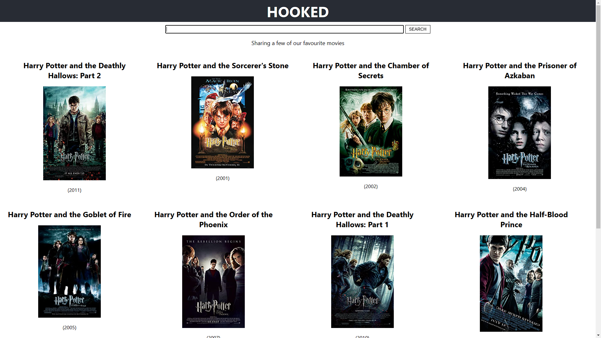

# Hook

## A Movie Search App made using React Hook

The app will be able to search for movies via the OMDB API and render the results to the user. The reason for building the app is just so that I can get a better understanding of using hooks in an application, which helps in understanding the role some of the hooks we will use can play in our own real-world apps.

